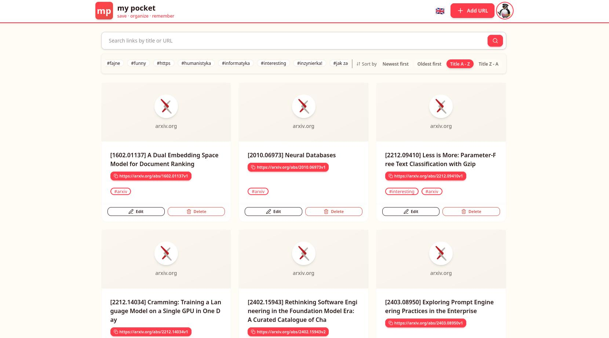
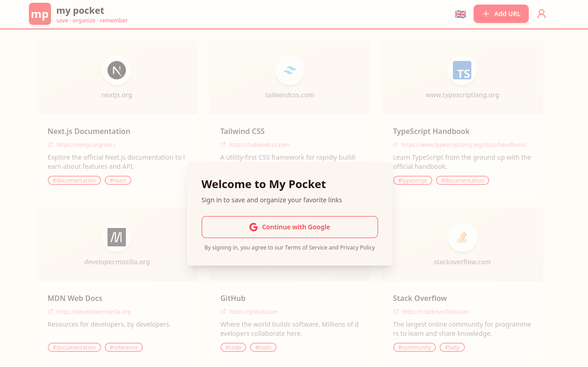
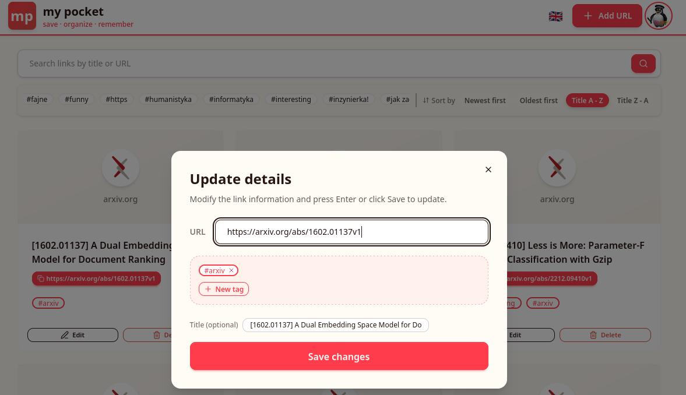
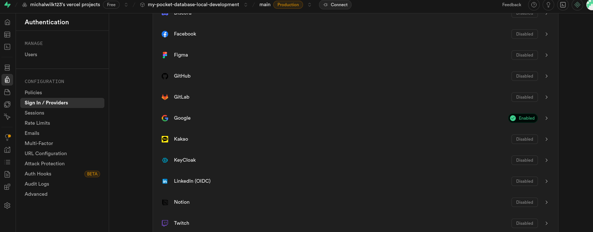
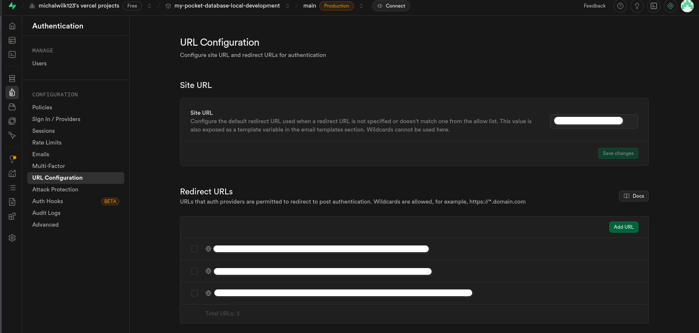

# My Pocket

A simple URL bookmark project with a web application and browser extension. Save, organize, and access your links across all devices with tagging, search. The application interface is available in 2 languages: English and Polish.

You can import / export bookmarks from old pocket app and instapaper app.

If you decide to go delete your account, you can export your bookmarks as a CSV file (pocket format)

Should be available i think in:
- https://mypocket.micwilk.com/
- https://my-pocket-eight.vercel.app/
- https://addons.mozilla.org/en-US/firefox/addon/mypocket
- https://chromewebstore.google.com/detail/kflelijdooijaedkdcfacheeenkmbagj


## Technologies

- **Frontend**: Next.js, React, TypeScript, Tailwind CSS, DaisyUI, Zustand
- **Backend**: Supabase (PostgreSQL, Authentication, Storage)
- **Browser Extension**: WXT Framework
- **Package Managers**: bun

## Demo

### Main page



### Non authorized view



### Import / Export


### Extension

#### Saving a link


#### Sign in with Google


### Edit link



## What to setup in supabase:

1) Create new database through vercel

2) Add a google OAuth provider

Go to `Authentication` -> `Sign in / Providers` -> `Auth Providers`



3) Create the database schema

Go to `Sql Editor`. In the text area, paste the content of `supabase-schema.sql` and click `Run`.

4) Setup auth redirects for the web app and extensions (firefox + chrome)



to get the link, use:

### For firefox:
```javascript
browser.identity.getRedirectURL()
```

### For chrome:
```javascript
chrome.identity.getRedirectURL()
```
